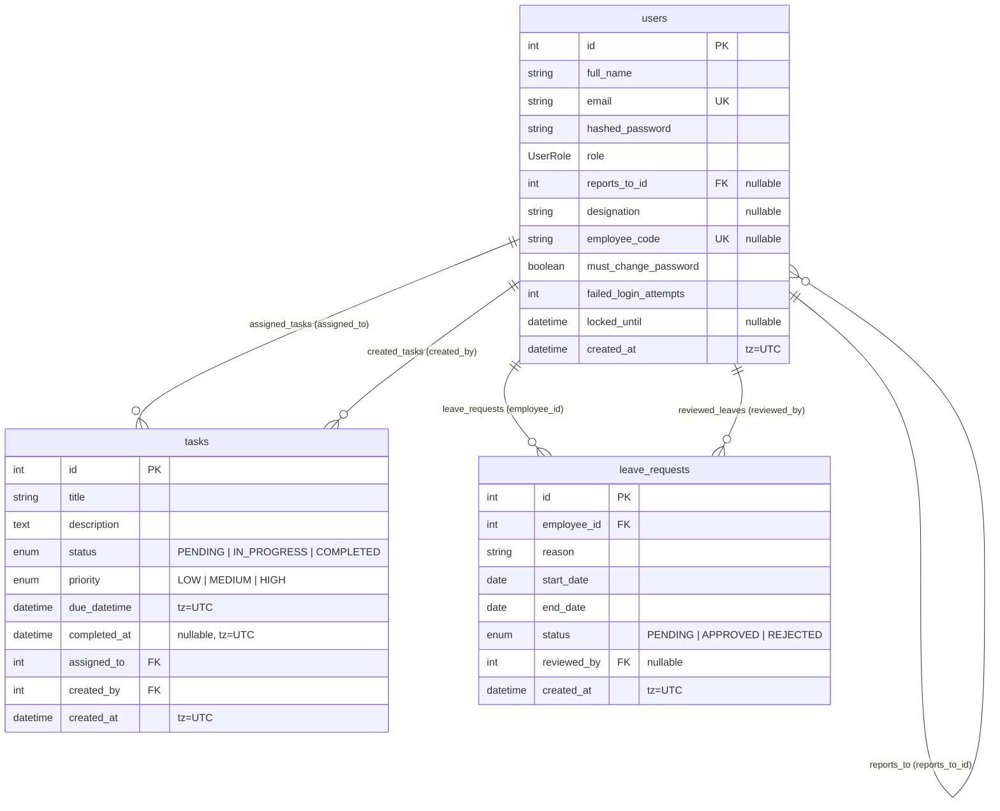
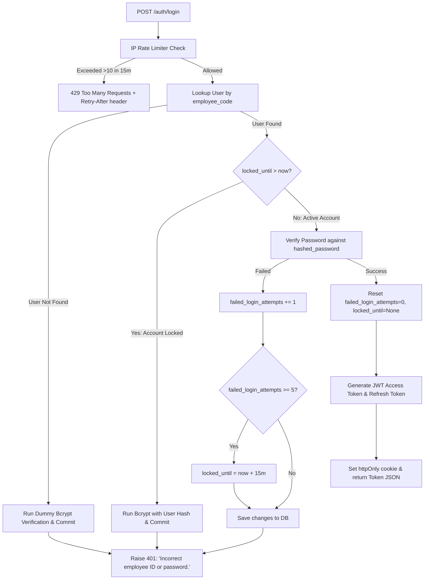

# Backend Architecture & Technical Reference

This document provides the authoritative technical reference for the Employee Task Management System's FastAPI backend service.

---

## 1. Tech Stack & Dependencies

The backend is built with Python 3.11+ using an asynchronous architecture across web, database, and background layers.

| Package | Version Constraint | Purpose |
|---|---|---|
| **fastapi** | `>=0.110.0` | Asynchronous ASGI Web Framework |
| **uvicorn** | `>=0.28.0` | High-performance ASGI Web Server |
| **sqlalchemy** | `>=2.0.28` | Async ORM & SQL Query Builder (Declarative 2.0 style) |
| **asyncpg** | `>=0.29.0` | High-performance async PostgreSQL driver |
| **alembic** | `>=1.13.1` | Database Schema Migrations |
| **bcrypt** | `>=4.1.2` | Secure password hashing (`gensalt()`, `hashpw()`, `checkpw()`) |
| **pyjwt[crypto]** | `>=2.8.0` | JSON Web Token encode/decode with HMAC-SHA256 |
| **pydantic** | `>=2.6.4` | Data validation, type coercion, and serialization (v2) |
| **email-validator** | `>=2.1.0` | Email string validation for Pydantic `EmailStr` |
| **pydantic-settings** | `>=2.2.1` | Type-safe settings management via `.env` files |
| **python-dotenv** | `>=1.0.1` | Environment variable management |
| **python-multipart** | `>=0.0.7` | Form-data parsing for OAuth2 password request forms |

---

## 2. Directory Structure & File Map

```text
app/
├── core/
│   ├── config.py            # Pydantic Settings class loading env vars (DB URL, JWT secrets, SMTP, CORS)
│   ├── email.py             # SMTP email dispatch utility for employee onboarding welcome emails
│   ├── exceptions.py        # Central domain exception hierarchy (AppException, NotFound, Auth, etc.)
│   ├── rate_limit.py        # RateLimiter abstract interface and InMemoryRateLimiter sliding-window implementation
│   └── security.py          # Password hashing, JWT token creation/decoding, and FastAPI auth dependencies
├── db/
│   ├── base.py              # Async SQLAlchemy engine, AsyncSessionLocal sessionmaker, and Base declarative model
│   └── session.py           # get_db FastAPI dependency yielding AsyncSession per request
├── models/
│   ├── leave.py             # LeaveRequest ORM model and LeaveStatus enum
│   ├── task.py              # Task ORM model, TaskStatus enum, and TaskPriority enum
│   └── user.py              # User ORM model and UserRole enum
├── routes/
│   ├── analytics.py         # /analytics router (PerformanceStats calculation)
│   ├── auth.py              # /auth router (login, swagger-login, refresh, logout, change-password)
│   ├── leaves.py            # /leaves router (submit leave, list leaves, list team leaves, review leave)
│   ├── tasks.py             # /tasks router (create task, list tasks, list team tasks, update task, delete task)
│   └── users.py             # /users router (me, me/reports, patch me, list employees, create employee, reset password, update manager)
├── schemas/
│   ├── analytics.py         # Pydantic models: PerformanceStats, TrailItem
│   ├── leave.py             # Pydantic models: LeaveCreate, LeaveRead, LeaveUpdateStatus
│   ├── task.py              # Pydantic models: TaskCreate, TaskRead, TaskUpdate, TaskUpdateStatus
│   └── user.py              # Pydantic models: UserRead, UserLogin, EmployeeCreate, EmployeeCreateResponse, PasswordChange, Token
└── main.py                  # FastAPI application bootstrap, CORS middleware, router registration, exception handlers
alembic/
├── env.py                   # Async Alembic execution environment configuring target metadata
├── script.py.mako           # Migration script template
└── versions/                # Database migration version files (f2850ec5859c -> d4e5f6g7h8i9)
scripts/
├── run_qa_suite.py          # Automated HTTP API test script executing full functional test cases
├── seed_admin.py            # Interactive/CLI script for seeding initial ADMIN user
├── test_endpoints.py        # Lightweight endpoint smoke testing script
└── unlock_user.py           # Administrative CLI utility to unlock locked employee accounts
tests/
├── conftest.py              # Pytest async fixtures (in-memory SQLite, AsyncClient, test users, auth headers, rate-limit reset)
├── test_analytics.py        # Unit and integration tests for performance analytics and scoping
├── test_auth.py             # Tests for login, token refresh, logout, password change
├── test_employee_creation.py# Tests for admin employee creation, code generation, and temporary passwords
├── test_leaves.py           # Tests for leave submission, listing, and approval workflows
├── test_login_security.py   # Tests for account lockout (5 fails / 15 min), IP rate limiting (10 / 15 min), and timing attacks
├── test_manager_scoping.py  # Tests for manager-direct report task and leave scoping rules
├── test_rbac.py             # Role-based access control tests across all endpoints
├── test_services.py         # Direct domain service layer unit tests
├── test_tasks.py            # Tests for task CRUD, status transitions, and completed_at timestamps
└── test_users.py            # Tests for user profile routes and management
```

---

## 3. Database Models & Schema Specifications

The database schema is managed through SQLAlchemy 2.0 Declarative Base (`app.db.base.Base`) with PostgreSQL as the target database engine.



### 3.1 Model: `User` (`app/models/user.py` -> `users` table)

| Column Name | Type | Constraints / Default | Description |
|---|---|---|---|
| `id` | `Integer` | Primary Key, Indexed | Unique internal user ID |
| `full_name` | `String` | Non-nullable | Full name of the user |
| `email` | `String` | Unique, Indexed, Non-nullable | User email address |
| `hashed_password` | `String` | Non-nullable | Bcrypt hashed password string |
| `role` | `SQLEnum(UserRole)` | Non-nullable, default=`EMPLOYEE` | Role: `ADMIN` or `EMPLOYEE` |
| `reports_to_id` | `Integer` | Foreign Key (`users.id`, `ondelete="SET NULL"`), Nullable | Direct supervisor's user ID |
| `designation` | `String(100)` | Nullable, default=`None` | Job title (e.g. "Lead Engineer", "HR Head") |
| `employee_code` | `String` | Unique, Indexed, Nullable | Sequential identifier (e.g. `EMP-1001`) |
| `must_change_password` | `Boolean` | Non-nullable, default=`False` | Forces password change before API access |
| `failed_login_attempts` | `Integer` | Non-nullable, default=`0` | Counter for consecutive bad password logins |
| `locked_until` | `DateTime(timezone=True)` | Nullable, default=`None` | Timestamp until which the account is locked |
| `created_at` | `DateTime(timezone=True)` | Non-nullable, server_default=`func.now()` | Account creation timestamp |

**Relationships:**
- `reports_to`: `relationship("User", remote_side=[id], foreign_keys=[reports_to_id], back_populates="direct_reports")`
- `direct_reports`: `relationship("User", foreign_keys=[reports_to_id], back_populates="reports_to")`
- `assigned_tasks`: `relationship("Task", foreign_keys="Task.assigned_to", back_populates="assigned_employee", cascade="all, delete-orphan")`
- `created_tasks`: `relationship("Task", foreign_keys="Task.created_by", back_populates="creator", cascade="all, delete-orphan")`
- `leave_requests`: `relationship("LeaveRequest", foreign_keys="LeaveRequest.employee_id", back_populates="employee", cascade="all, delete-orphan")`
- `reviewed_leaves`: `relationship("LeaveRequest", foreign_keys="LeaveRequest.reviewed_by", back_populates="reviewer")`

### 3.2 Model: `Task` (`app/models/task.py` -> `tasks` table)

| Column Name | Type | Constraints / Default | Description |
|---|---|---|---|
| `id` | `Integer` | Primary Key, Indexed | Unique task ID |
| `title` | `String` | Non-nullable | Brief summary of the task |
| `description` | `Text` | Non-nullable | Detailed task requirements |
| `status` | `SQLEnum(TaskStatus)` | Non-nullable, default=`PENDING` | `PENDING`, `IN_PROGRESS`, `COMPLETED` |
| `priority` | `SQLEnum(TaskPriority)` | Non-nullable | `LOW`, `MEDIUM`, `HIGH` |
| `due_datetime` | `DateTime(timezone=True)` | Non-nullable | Exact deadline timestamp with timezone |
| `completed_at` | `DateTime(timezone=True)` | Nullable, default=`None` | Timestamp recorded when marked `COMPLETED` |
| `assigned_to` | `Integer` | Foreign Key (`users.id`, `ondelete="CASCADE"`), Non-nullable | Assignee user ID |
| `created_by` | `Integer` | Foreign Key (`users.id`, `ondelete="CASCADE"`), Non-nullable | Creator user ID |
| `created_at` | `DateTime(timezone=True)` | Non-nullable, server_default=`func.now()` | Task creation timestamp |

**Relationships:**
- `assigned_employee`: `relationship("User", foreign_keys=[assigned_to], back_populates="assigned_tasks")`
- `creator`: `relationship("User", foreign_keys=[created_by], back_populates="created_tasks")`

### 3.3 Model: `LeaveRequest` (`app/models/leave.py` -> `leave_requests` table)

| Column Name | Type | Constraints / Default | Description |
|---|---|---|---|
| `id` | `Integer` | Primary Key, Indexed | Unique leave request ID |
| `employee_id` | `Integer` | Foreign Key (`users.id`, `ondelete="CASCADE"`), Non-nullable | Applicant user ID |
| `reason` | `String` | Non-nullable | Statement of reason for absence |
| `start_date` | `Date` | Non-nullable | Absence start date |
| `end_date` | `Date` | Non-nullable | Absence end date (must be `>= start_date`) |
| `status` | `SQLEnum(LeaveStatus)` | Non-nullable, default=`PENDING` | `PENDING`, `APPROVED`, `REJECTED` |
| `reviewed_by` | `Integer` | Foreign Key (`users.id`, `ondelete="SET NULL"`), Nullable | Manager or Admin who reviewed |
| `created_at` | `DateTime(timezone=True)` | Non-nullable, server_default=`func.now()` | Submission timestamp |

**Relationships:**
- `employee`: `relationship("User", foreign_keys=[employee_id], back_populates="leave_requests")`
- `reviewer`: `relationship("User", foreign_keys=[reviewed_by], back_populates="reviewed_leaves")`

---

## 4. API Route Reference

All routes are mounted under specific prefixes with structured request/response schemas and centralized error handling.

### 4.1 Authentication Router (`app/routes/auth.py` -> `/auth`)

| Method | Path | Auth / Role Requirement | Request Schema | Response Schema / Status | Description |
|---|---|---|---|---|---|
| `POST` | `/auth/login` | Public (IP Rate limited: 10/15min) | `UserLogin` (`employee_code`, `password`) | `Token` (200 OK) + `refresh_token` httpOnly cookie | Authenticate employee ID & password, set refresh cookie |
| `POST` | `/auth/swagger-login` | Public (Form-data) | `OAuth2PasswordRequestForm` | `Token` (200 OK) | Form-based login for Swagger UI Authorize modal |
| `POST` | `/auth/refresh` | `refresh_token` cookie | None (reads cookie) | `Token` (200 OK) + rotated cookie | Rotate refresh token and issue fresh access token |
| `POST` | `/auth/logout` | Public | None | `{"message": "Logged out successfully"}` (200 OK) | Clears httpOnly `refresh_token` cookie |
| `POST` | `/auth/change-password` | Bearer Token (Allows `must_change_password=True`) | `PasswordChange` (`current_password`, `new_password`) | `UserRead` (200 OK) | Update password and clear `must_change_password` flag |

### 4.2 Users Router (`app/routes/users.py` -> `/users`)

| Method | Path | Auth / Role Requirement | Request Schema | Response Schema / Status | Description |
|---|---|---|---|---|---|
| `GET` | `/users/me` | Bearer Token (Password change cleared) | None | `UserRead` (200 OK) | Get authenticated user profile |
| `GET` | `/users/me/reports` | Bearer Token (Password change cleared) | None | `list[UserRead]` (200 OK) | Get direct reports of authenticated user |
| `PATCH` | `/users/me` | Bearer Token (Password change cleared) | `UserUpdate` (`full_name`, `designation`) | `UserRead` (200 OK) | Update user's own display profile |
| `GET` | `/users/` | `ADMIN` Role | None | `list[UserRead]` (200 OK) | List all employees in the system |
| `POST` | `/users/employees` | `ADMIN` Role | `EmployeeCreate` (`full_name`, `email`, `reports_to_id`, `designation`) | `EmployeeCreateResponse` (201 Created) | Provision employee with generated code & temp password |
| `POST` | `/users/{user_id}/reset-temp-password` | `ADMIN` Role | None | `{"id": int, "email_sent": bool}` (200 OK) | Reset employee password to new temp password & resend email |
| `PATCH` | `/users/{user_id}/reports-to` | `ADMIN` Role | `UserReportsToUpdate` (`reports_to_id`) | `UserRead` (200 OK) | Assign or update employee's supervisor (cycle-checked) |

### 4.3 Tasks Router (`app/routes/tasks.py` -> `/tasks`)

| Method | Path | Auth / Role Requirement | Query / Path Params | Request Schema | Response Schema / Status | Description |
|---|---|---|---|---|---|---|
| `POST` | `/tasks/` | `ADMIN` or Direct Manager of Assignee | None | `TaskCreate` | `TaskRead` (201 Created) | Assign task to employee |
| `GET` | `/tasks/team` | Bearer Token (Password change cleared) | `status`, `priority`, `sort_by`, `skip`, `limit` | None | `list[TaskRead]` (200 OK) | List tasks assigned to caller's direct reports |
| `GET` | `/tasks/` | Bearer Token (Password change cleared) | `status`, `priority`, `sort_by`, `skip`, `limit` | None | `list[TaskRead]` (200 OK) | List tasks (Admin: all, Employee: self) |
| `GET` | `/tasks/{id}` | Bearer Token (Admin or Assignee) | `id: int` | None | `TaskRead` (200 OK) | Fetch single task details |
| `PATCH` | `/tasks/{id}` | Bearer Token (Admin: all fields, Employee: status only) | `id: int` | `TaskUpdate` | `TaskRead` (200 OK) | Update task fields / status |
| `DELETE` | `/tasks/{id}` | `ADMIN` Role | `id: int` | None | 204 No Content | Remove task from system |

### 4.4 Leaves Router (`app/routes/leaves.py` -> `/leaves`)

| Method | Path | Auth / Role Requirement | Query Params | Request Schema | Response Schema / Status | Description |
|---|---|---|---|---|---|
| `POST` | `/leaves/` | Bearer Token (Password change cleared) | None | `LeaveCreate` | `LeaveRead` (201 Created) | Submit a personal leave request |
| `GET` | `/leaves/` | Bearer Token (Password change cleared) | `status`, `sort_by`, `skip`, `limit` | None | `list[LeaveRead]` (200 OK) | List leaves (Admin: all, Employee: self) |
| `GET` | `/leaves/team` | Bearer Token (Password change cleared) | `status` (default `PENDING`), `sort_by`, `skip`, `limit` | None | `list[LeaveRead]` (200 OK) | List leave requests submitted by direct reports |
| `PATCH` | `/leaves/{id}` | `ADMIN` or Direct Manager of Applicant | `id: int` | `LeaveUpdateStatus` | `LeaveRead` (200 OK) | Approve or reject a leave request |

### 4.5 Analytics Router (`app/routes/analytics.py` -> `/analytics`)

| Method | Path | Auth / Role Requirement | Query Params | Request Schema | Response Schema / Status | Description |
|---|---|---|---|---|---|
| `GET` | `/analytics/performance` | Bearer Token (Password change cleared) | `employee_id: int | None`, `trail_limit: int = 10` | None | `PerformanceStats` (200 OK) | Compute completion rate, metrics breakdown, and milestone trail |

---

## 5. Authentication, Security & Hardening Mechanics



### 5.1 Dual-Token Authentication Flow
1. **Access Token**:
   - Short-lived JWT (default 15 minutes, configurable via `ACCESS_TOKEN_EXPIRE_MINUTES`).
   - Encoded with payload `{"sub": email, "role": role, "type": "access", "iat": now, "exp": expire}` using `HS256` algorithm and `JWT_SECRET_KEY`.
   - Stored purely in frontend application memory (Zustand store).
2. **Refresh Token**:
   - Long-lived JWT (default 7 days, configurable via `REFRESH_TOKEN_EXPIRE_DAYS`).
   - Encoded with payload `{"sub": email, "role": role, "type": "refresh", "iat": now, "exp": expire}` using `HS256` and `JWT_REFRESH_SECRET_KEY`.
   - Placed exclusively in an `httpOnly`, `SameSite=Lax`, `path="/auth"` cookie (`COOKIE_SECURE=True` in production HTTPS).
   - Inaccessible to client JavaScript, mitigating Cross-Site Scripting (XSS) token theft.

### 5.2 Account Lockout Defense
- **Threshold**: 5 consecutive failed login attempts locks the account for 15 minutes (`timedelta(minutes=15)`).
- **Auto-Reset**: Successful authentication automatically clears `failed_login_attempts = 0` and `locked_until = None`.
- **Manual Unlock**: System administrators can run `python scripts/unlock_user.py EMP-XXXX` to immediately restore access.

### 5.3 IP-Based Sliding-Window Rate Limiting
- **Threshold**: 10 login requests per client IP within a 15-minute (900s) sliding window.
- **Client IP Resolution**: Evaluates `X-Forwarded-For` header first (extracting left-most client IP), falling back to `request.client.host`.
- **HTTP 429 Response**: Returns `429 Too Many Requests` with a standard `Retry-After: <seconds>` response header.
- **Interface-Based Architecture**: Implemented via abstract base class `RateLimiter` (`app/core/rate_limit.py`). The current `InMemoryRateLimiter` can be swapped for a distributed `RedisRateLimiter` with zero changes to route or service layers.

### 5.4 Timing Attack Mitigation & Anti-Enumeration
To prevent attackers from using response timing or error messages to enumerate valid employee IDs or detect locked accounts:
1. **Constant-Time Execution**: If an `employee_code` does not exist in the database, `auth_service.authenticate_user` executes `verify_password(password, DUMMY_HASH)` against a pre-computed bcrypt hash.
2. **Locked Account Execution**: If an account is locked, bcrypt password verification is still performed against `user.hashed_password` before rejecting.
3. **Identical DB I/O**: `await db.commit()` is executed on all failure branches to ensure uniform database I/O latency.
4. **Generic Messaging**: All login failures (non-existent ID, incorrect password, locked account) return identical HTTP 401 status with the exact message: `"Incorrect employee ID or password."`.
5. **Manager Analytics Protection**: When a manager requests analytics for an employee ID that is either non-existent or outside their reporting chain, the system returns a generic `403 Forbidden` (`"You do not have permission to view performance analytics for this employee."`) to prevent ID enumeration.

---

## 6. Alembic Migration History

All migrations are tracked under `alembic/versions/` and execute sequentially:

| Revision ID | Down Revision | Description | Schema Changes |
|---|---|---|---|
| `f2850ec5859c` | `None` | Initial migration | Creates base tables `users`, `tasks`, `leave_requests`, enum types (`userrole`, `taskstatus`, `taskpriority`, `leavestatus`), foreign keys, and indexes. |
| `a1b2c3d4e5f6` | `f2850ec5859c` | Add `manager_id` to users | Adds nullable column `users.manager_id` with foreign key `fk_users_manager_id_users` pointing to `users.id` (`ondelete="SET NULL"`). |
| `b2c3d4e5f6g7` | `a1b2c3d4e5f6` | Add `employee_code` and `must_change_password` | Adds nullable `users.employee_code`, non-nullable `users.must_change_password` (`default=false`), backfills existing users with `EMP-1001`, `EMP-1002`, etc., sets `employee_code` to non-nullable with unique index. |
| `c3d4e5f6g7h8` | `b2c3d4e5f6g7` | Convert `due_date` to `due_datetime` and add `completed_at` | Adds nullable `tasks.completed_at` timestamp, adds `tasks.due_datetime`, backfills existing dates with `23:59:59 UTC`, converts `due_datetime` to non-nullable, and drops old `due_date` column. |
| `d4e5f6g7h8i9` | `c3d4e5f6g7h8` | Add account lockout columns | Adds non-nullable `users.failed_login_attempts` (`default=0`) and nullable `users.locked_until` timestamp (`DateTime(timezone=True)`). |
| `e5f6g7h8i9j0` | `d4e5f6g7h8i9` | Rename `manager_id` to `reports_to_id` & add `designation` | Renames column `users.manager_id` to `users.reports_to_id` (updating foreign key to `fk_users_reports_to_id_users`) and adds nullable `users.designation` (`varchar(100)`). |

---

## 7. Business Logic & Scoping Rules

### 7.1 `completed_at` Timestamp Lifecycle
- In `task_service.update_task`, when `status` transitions from any state to `TaskStatus.COMPLETED`, `task.completed_at` is automatically stamped with `datetime.now(UTC)`.
- If a completed task is subsequently reopened to `PENDING` or `IN_PROGRESS`, `task.completed_at` is automatically reset to `None`.

### 7.2 Hierarchy Scoping & Assignment Rules
- **Task Assignment**:
  - Admins can assign tasks to any employee.
  - Managers / Supervisors can only assign tasks to their direct reports (`assignee.reports_to_id == creator.id`).
  - Self-assignment via the manager route is blocked (`task_in.assigned_to != creator.id`).
  - Tasks can only be assigned to users with role `EMPLOYEE`.
- **Leave Review**:
  - Admins can review all leave requests.
  - Managers / Supervisors can only review leave requests submitted by their direct reports.
  - Users cannot approve or reject their own leave requests.
  - Only leave requests in `PENDING` status can be reviewed, transitioning strictly to `APPROVED` or `REJECTED`.
- **Supervisor Assignment Validation**:
  - A user cannot report to themselves (`reports_to_id != target_user_id`).
  - Circular reporting chains are detected and prevented by traversing up the reporting chain prior to assignment.

### 7.3 Canonical Analytics Classification Logic
The system evaluates task completion states using SQL `CASE` expressions in `analytics_service.py` that strictly match `_classify_task_state`:

$$\text{State} = \begin{cases} 
\text{on\_time} & \text{if } \text{status} = \text{COMPLETED} \land \text{completed\_at} \le \text{due\_datetime} \\
\text{late} & \text{if } \text{status} = \text{COMPLETED} \land (\text{completed\_at} > \text{due\_datetime} \lor \text{completed\_at is NULL}) \\
\text{overdue} & \text{if } \text{status} \ne \text{COMPLETED} \land \text{due\_datetime} < \text{now} \\
\text{pending} & \text{if } \text{status} \ne \text{COMPLETED} \land \text{due\_datetime} \ge \text{now}
\end{cases}$$

$$\text{Completion Rate} = \begin{cases} 
\frac{\text{on\_time\_count}}{\text{on\_time\_count} + \text{late\_count}} & \text{if } (\text{on\_time\_count} + \text{late\_count}) > 0 \\
0.0 & \text{otherwise}
\end{cases}$$

**Analytics Scoping Matrix:**
- **Employee without reports**: Evaluates own tasks (`scope="self"`). Passing non-matching `employee_id` returns `403 Forbidden`.
- **Manager (with direct reports)**:
  - Without `employee_id`: Computes team aggregate across direct reports (`scope="team"`).
  - With `employee_id == user.id`: Computes manager's personal performance (`scope="self"`).
  - With `employee_id` in direct reports: Computes individual report's performance (`scope="employee"`).
  - With `employee_id` outside direct reports: Returns generic `403 Forbidden`.
- **Admin**:
  - Without `employee_id`: Computes organization-wide aggregate across all tasks (`scope="org"`).
  - With `employee_id`: Computes individual employee performance (`scope="employee"`, returns `404 Not Found` if user doesn't exist).
